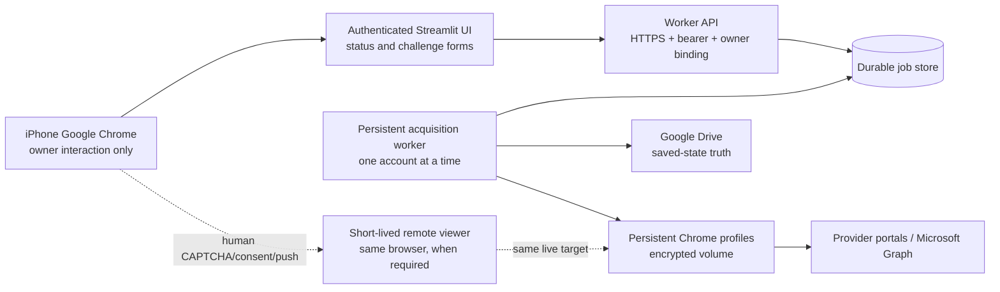

# GetReceipt iPhone-only architecture

Status: implementation contract
Last reviewed: 2026-07-19

## Decision

GetReceipt can support **iPhone-only operation** when that phrase means:

- the owner starts and monitors acquisition from Google Chrome on iPhone;
- the owner receives and enters OTP/security codes on the iPhone;
- Microsoft consent and MFA happen in Google Chrome on iPhone through the official OAuth flow;
- a persistent, remotely hosted worker owns the acquisition browser and keeps running while
  iPhone Chrome is suspended or reloaded;
- the owner never has to start, unlock, or operate a Windows PC.

The worker may run on Linux or Windows. Windows is not a product requirement.
The acquisition browser is official Google Chrome Stable; Chromium, Safari,
and Edge are not supported production substitutes. The iPhone Chrome UI and
the worker Chrome are separate browser instances and never exchange cookies.

The following stricter interpretation is not technically viable:

> iPhone Chrome and Streamlit Community Cloud alone, without a persistent worker, must
> background-control four unrelated provider sites.

An iOS browser cannot expose its authenticated cookies to this server, provide a durable
server-controlled Chrome target, or continue arbitrary multi-site browser automation after the
tab is suspended. Streamlit Community Cloud local state is also not a durable job store.

## Promise boundary

The system guarantees safe recovery and an honest terminal state; it cannot guarantee that a
third-party provider will always permit an automated login.

GetReceipt must never:

- solve or outsource CAPTCHA;
- copy a CAPTCHA response from another browser;
- transfer iPhone Chrome cookies into the worker;
- bypass passkey proximity or device-integrity checks;
- classify an unknown security screen as a successful login;
- retain passwords, cookies, OTP values, raw HTML, or CAPTCHA tokens in job history.

If a provider only offers a remote-incompatible platform passkey, or rejects the worker
environment, the job must stop as `INTERVENTION_REQUIRED` and offer an official fallback such
as another authentication method or manual PDF upload.

## Runtime architecture



Streamlit is only the mobile control plane. It must not own the live acquisition process or be
the source of truth for job state.

## Job state contract

The durable worker API exposes one batch job per target month:

```text
QUEUED
RUNNING
WAITING_FOR_CHALLENGE
SUCCEEDED
FAILED
INTERVENTION_REQUIRED
CANCELLED
```

Each job has:

- an opaque UUID;
- an owner identifier;
- target month and ordered service IDs;
- completed service IDs and current service;
- a monotonically increasing version;
- a sanitized event timeline;
- at most one active challenge;
- a sanitized error/result;
- created and updated timestamps.

Creating the same owner/month/service-set uses an idempotency key and returns the active
existing job. A reload on iPhone recovers the job from the API by job ID or target month; it
does not depend on `st.session_state`.

The worker:

- serializes acquisitions for this personal account;
- heartbeats while running;
- uses a persistent profile per service;
- uses a temporary download directory per job;
- verifies the expected month and PDF signature;
- treats Google Drive as the only receipt-completion truth;
- closes the browser but preserves its profile after terminal completion;
- marks a challenge expired after a worker restart instead of pretending the old browser still
  exists.

## Challenge contract

Supported challenge kinds:

```text
OTP_EMAIL
OTP_SMS
SECURITY_CODE
PUSH_APPROVAL
OAUTH_CONSENT
CAPTCHA_INTERACTIVE
CONSENT_INTERACTIVE
PASSKEY_UNAVAILABLE
UNKNOWN
```

An input challenge declares its actual input schema. Codes are not assumed to be six digits:

- label and masked destination;
- minimum and maximum length;
- accepted regular expression;
- input mode;
- expiry;
- attempt count where the provider exposes it.

An OTP/security-code response:

- is sent only in the HTTPS request body;
- is never placed in a URL, event, log, exception, or durable job metadata;
- exists in Streamlit widget/process memory only for the submitting rerun and is explicitly
  removed from widget state after a successful send;
- enters a process-local single-consumer inbox on the worker;
- is consumed at most once and immediately discarded;
- is rejected after expiry or after another response wins the race.

The owner may leave iPhone Chrome for Messages, Mail, or an authenticator and later reload the page.
The live worker browser is independent of the Streamlit WebSocket.

Interactive challenges use a short-lived, owner-bound viewer for the **same worker browser and
same target**. CDP, X11, and VNC are never exposed. Streamlit fetches a no-store PNG frame
server-to-server and relays only bounded click coordinates, text, and named key events over the
authenticated worker API. No public viewer URL is issued. The active challenge and job IDs bind
each operation, and the viewer is revoked when the challenge expires, is cancelled, or automation
resumes. Navigation remains subject to the worker's provider-origin checks.

## Service feasibility

| Service | iPhone-only route | Result |
| --- | --- | --- |
| Outlook / Tokuten | Microsoft Graph authorization-code flow with PKCE; consent and MFA in iPhone Chrome; encrypted refresh token on worker | Implemented route; preferred over Outlook Web automation |
| My Commufa | Worker keeps the login page; code received on iPhone is submitted to the exact live page | Supported, subject to live selector verification |
| EPOS Net | Worker keeps the login page; the owner enters the officially requested card/security code on iPhone | Conditional; exact challenge layout must be live-verified |
| Web Billing ID | Email OTP entered on iPhone and submitted to the exact live worker page | Supported design; subject to live selector verification |
| d-account SMS/email | Code or push approval completed from iPhone while worker polls the same login | Conditional |
| d-account platform/hybrid passkey on a remote VM | Remote browser lacks the iPhone's platform key and physical proximity/Bluetooth relationship | Not supported; select an official code method or manual fallback |
| CAPTCHA | Owner operates the same live worker browser through a short-lived remote viewer | Conditional; provider may still reject the worker environment |

Official constraints used for this decision:

- [Microsoft OAuth authorization-code flow](https://learn.microsoft.com/en-us/entra/identity-platform/v2-oauth2-auth-code-flow)
- [Microsoft Graph attachment retrieval](https://learn.microsoft.com/en-us/graph/api/attachment-get?view=graph-rest-1.0)
- [Commufa verification behavior](https://faq.commufa.jp/faq/show/3753?site_domain=default)
- [EPOS security-code guidance](https://faq.eposcard.co.jp/faq/show/1709?category_id=53&site_domain=default)
- [Web Billing email OTP guide](https://www.ntt-finance.co.jp/billing/service/webbill/guide/web/guide_10.html)
- [d-account passkey environment](https://id.smt.docomo.ne.jp/src/utility/detail_09_02.html)
- [reCAPTCHA token constraints](https://developers.google.com/recaptcha/docs/verify)
- [Streamlit local-storage limitation](https://docs.streamlit.io/develop/concepts/connections/connecting-to-data)

## Security and deployment requirements

Before the worker is reachable from production:

1. Make the Streamlit app private or configure OIDC and allow only the owner's subject.
2. Host the worker behind HTTPS on a persistent VM/container host.
3. Put the worker database and service profiles on an encrypted persistent volume.
4. Use a stable Japanese egress IP where possible.
5. Store provider credentials, Drive credentials, worker API token, and OAuth refresh tokens in
   the host secret manager; do not bake them into an image.
6. Allow inbound worker API traffic only through authenticated HTTPS; never expose CDP/VNC
   directly.
7. Back up the job database, not browser lock files or transient OTP data.
8. Alert on heartbeat loss, repeated login rejection, profile corruption, and provider layout
   change.

The production deployment uses a digest-pinned worker image. CI must reject the
image unless `Browser.getVersion` reports Google Chrome and the same profile
survives a browser restart. Running containers are never upgraded in place.

Required Streamlit secrets include owner OIDC and the worker connection:

```toml
[auth]
redirect_uri = "https://get-receipt.streamlit.app/oauth2callback"
cookie_secret = "generated high-entropy value"

[auth.microsoft]
client_id = "Microsoft application client id"
client_secret = "Microsoft application client secret"
server_metadata_url = "https://login.microsoftonline.com/consumers/v2.0/.well-known/openid-configuration"

[app_access]
mode = "oidc"
provider = "microsoft"
allowed_identity_hashes = ["sha256:replace-after-first-owner-login"]

[receipt_worker]
base_url = "https://receipt-worker.example.invalid"
api_token = "generated high-entropy token"
owner_id = "stable opaque owner id"
```

Required worker environment:

```text
GETRECEIPT_API_TOKEN
GETRECEIPT_OWNER_ID
GETRECEIPT_DATABASE_PATH
GETRECEIPT_PROFILE_ROOT
GETRECEIPT_DOWNLOAD_ROOT
GETRECEIPT_INSTANCE_LOCK_PATH
GOOGLE_SERVICE_ACCOUNT_JSON
GETRECEIPT_PROVIDER_CREDENTIALS_JSON
GETRECEIPT_MICROSOFT_CLIENT_ID
GETRECEIPT_MICROSOFT_CLIENT_SECRET
GETRECEIPT_MICROSOFT_REDIRECT_URI
GETRECEIPT_MICROSOFT_TENANT
GETRECEIPT_TOKEN_ENCRYPTION_KEY
BROWSER_EXECUTABLE  # fixed by production Compose to /usr/bin/google-chrome
```

On the first OIDC login, the locked page shows only the SHA-256 fingerprint of
the verified `iss|sub` identity. Register that exact value in
`allowed_identity_hashes`; the fingerprint is not a bearer credential and
cannot authenticate another user.

Two Microsoft app registrations are recommended: an owner-login OIDC app with
the exact `/oauth2callback` redirect, and a Graph app with the exact `/` redirect
and only delegated `Mail.Read`. This separates client secrets and permission
blast radius. Refresh tokens are encrypted with a Fernet key before they enter
SQLite; client secrets, provider passwords, Drive credentials, API tokens, and
the Fernet key remain in the host secret store.

## Acceptance tests

The implementation is acceptable only when all applicable tests pass:

### Mobile recovery

1. Start a job.
2. Reach an OTP challenge.
3. Discard local UI session state and reload using only the job URL/month.
4. Recover the same job and challenge from the worker API.
5. Submit the response and finish the same browser attempt.

### Secret handling

- Double-submit is accepted once.
- An expired or already-consumed response is rejected.
- OTP is absent from URLs, job JSON, database rows, event history, logs, exceptions, and
  retained Streamlit widget state after successful submission.
- A different owner cannot read, cancel, or answer a job.

### Crash behavior

- A worker restart does not mark an in-flight receipt successful.
- A challenge whose browser was lost expires and causes a fresh login attempt.
- Retrying after an upload response loss does not create a duplicate Drive receipt.

### Provider safety

- Wrong-month PDF and HTML disguised as PDF are rejected.
- Unknown challenge screens stop for intervention.
- CAPTCHA is never auto-solved.
- A remote-only passkey request is never reported as supported.

### Manual fallback

- A PDF selected from iPhone Files must start with a PDF signature and stay within the size cap.
- Partner/month mismatches require an explicit confirmation and are never silently accepted.
- Manual save uses the same naming, Drive duplicate check, upload, and verification path.
- Manual save cannot race an active or connectivity-unknown automatic acquisition.
- In remote-worker mode, Streamlit never writes the selected PDF to Drive. It sends the raw
  `application/pdf` body (never base64) to the authenticated owner-scoped worker endpoint.
- The worker enforces the 20 MiB limit again and performs the Drive write under the same
  process-level acquisition and commit guards as automatic acquisition. Local-only mode keeps
  the in-process fallback.

### iPhone Chrome production journey

1. Log in through OIDC and reject every non-allowlisted identity.
2. Complete Microsoft Graph consent/MFA and return to the exact app-root callback.
3. Start acquisition, suspend Chrome, reload it, and recover the same durable job.
4. Complete OTP and interactive viewer routes without exposing worker credentials to the browser.
5. Verify one correct-month PDF per service in Google Drive from iPhone Chrome.
6. Retry a failed service without duplicating completed receipts.
7. Upload a provider PDF manually when an official remote-compatible authentication path does
   not exist.

### End-to-end proof levels

```text
L1  Contract tests: job durability, API auth, one-time response, reload recovery
L2  Local integration: API + worker + fake provider + Drive double
L3  Hosted integration: iPhone Chrome -> deployed worker using test challenges
L4  Provider validation: each real account, target month, and challenge route
```

L1 and L2 can be completed in this repository. L3 requires a selected persistent host and TLS
endpoint. L4 requires the owner's real provider challenges and cannot be truthfully claimed from
unit tests alone.

The executable production checklist is maintained in `deploy/README.md`. The
goal “all features are sufficiently usable from iPhone only” is not complete
until its L3 and L4 checks pass in Google Chrome on the owner's iPhone.
